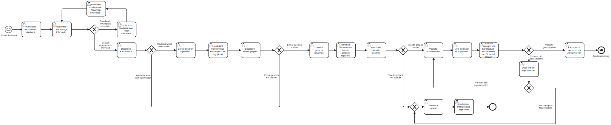

[BPMN](bpmn/recruitment_process.bpmn)




### Overzicht van de GitHub Actions Workflow

Deze repository maakt gebruik van een GitHub Actions workflow om automatisch een visuele representatie van het BPMN (Business Process Model and Notation) diagram te genereren en toe te voegen aan de `README.md`. Hierdoor blijft de documentatie up-to-date zonder handmatige tussenkomst.

#### Wat Doet de Workflow?

De workflow voert de volgende stappen uit telkens wanneer er een push of pull request naar de `main` branch wordt gedaan:

1. **Repository Checkout**:
   - Haalt de laatste versie van de repository binnen zodat de workflow toegang heeft tot de bestanden.

2. **Zoeken naar het BPMN-bestand**:
   - Parseert de `README.md` om het pad naar het BPMN-bestand te vinden. Dit wordt gedaan door te zoeken naar een Markdown-link naar een `.bpmn` bestand, bijvoorbeeld:
     ```markdown
     [BPMN Diagram](path/to/your/file.bpmn)
     ```

3. **Genereren van de SVG Afbeelding**:
   - Verstuurt het BPMN-bestand naar de [Kroki](https://kroki.io/) API om een SVG-afbeelding te genereren van het BPMN-diagram.
   - Slaat de gegenereerde `diagram.svg` op in de `images` directory van de repository.

4. **Bijwerken van de README.md**:
   - Controleert of de sectie "## BPMN Diagram" al bestaat in de `README.md`.
